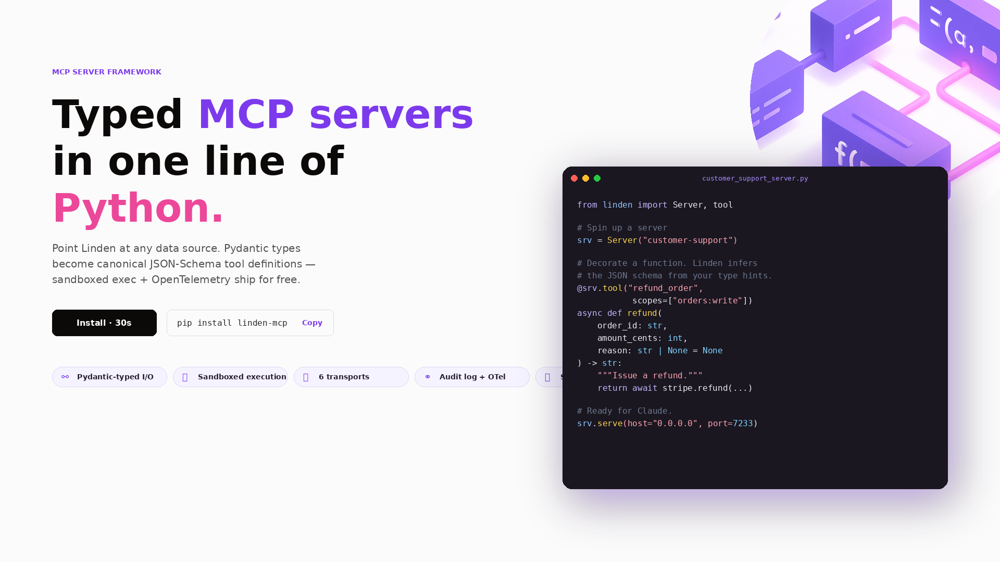
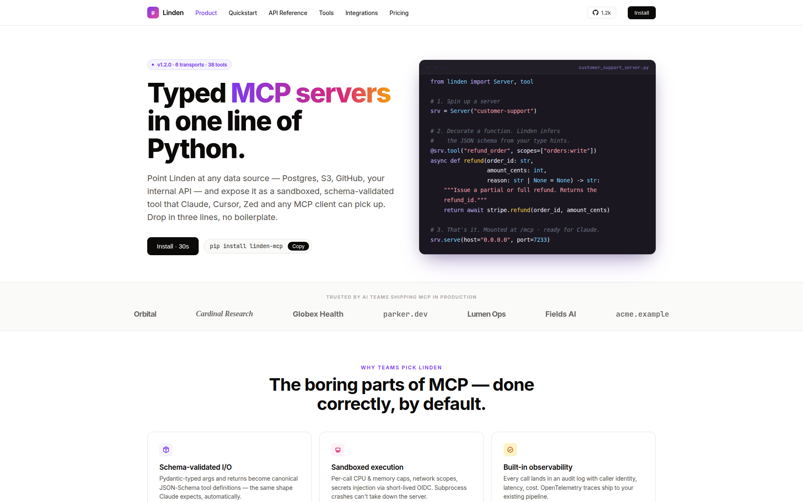
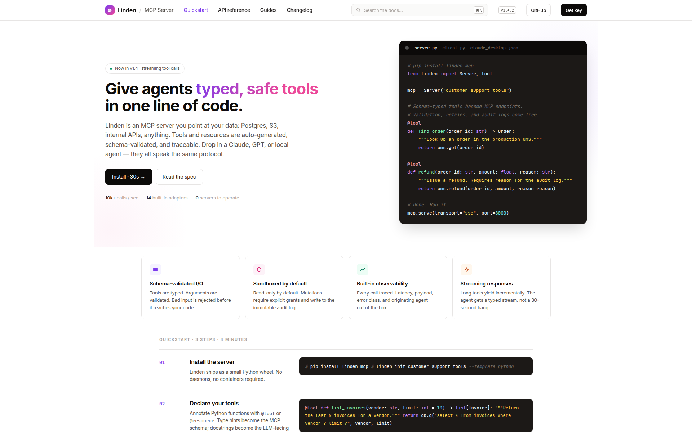
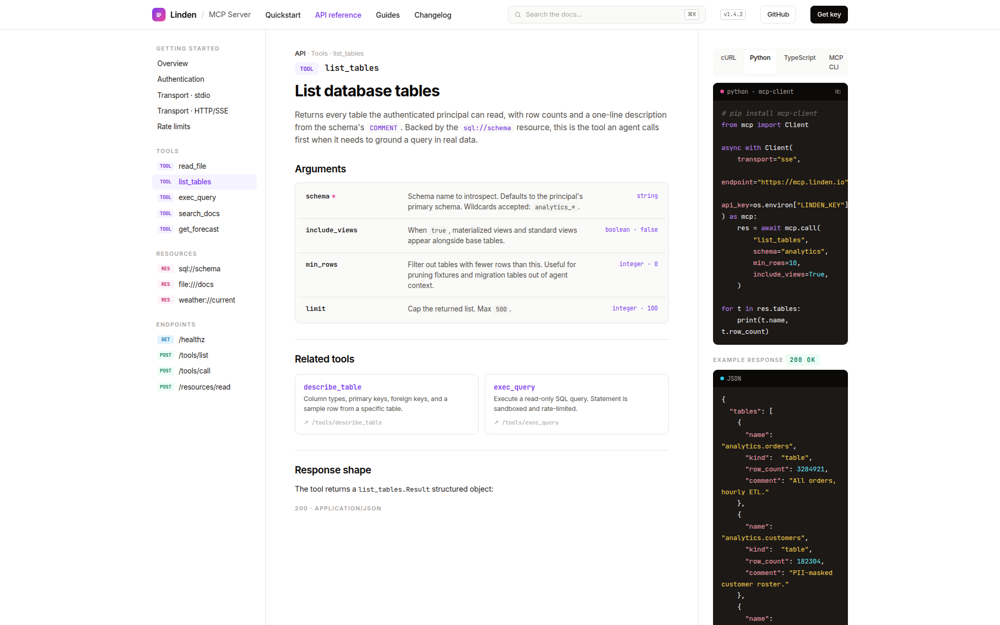
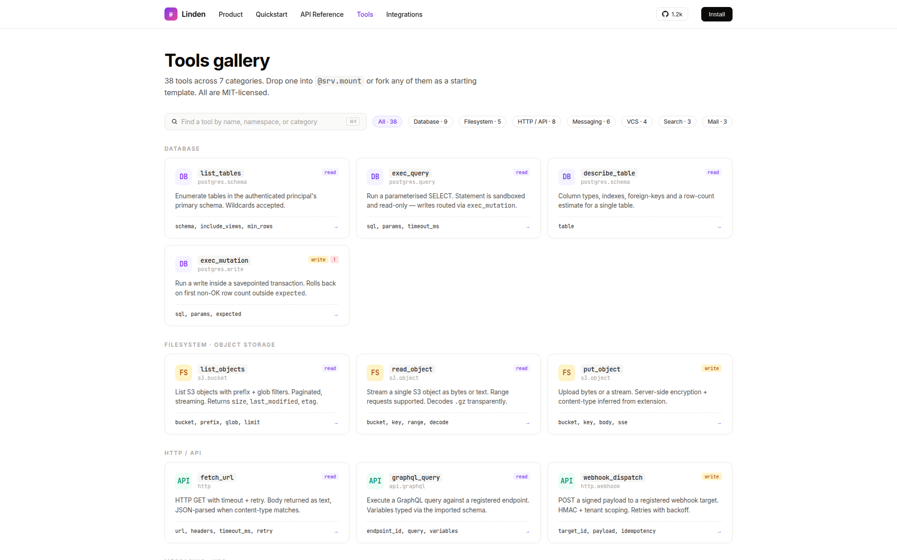
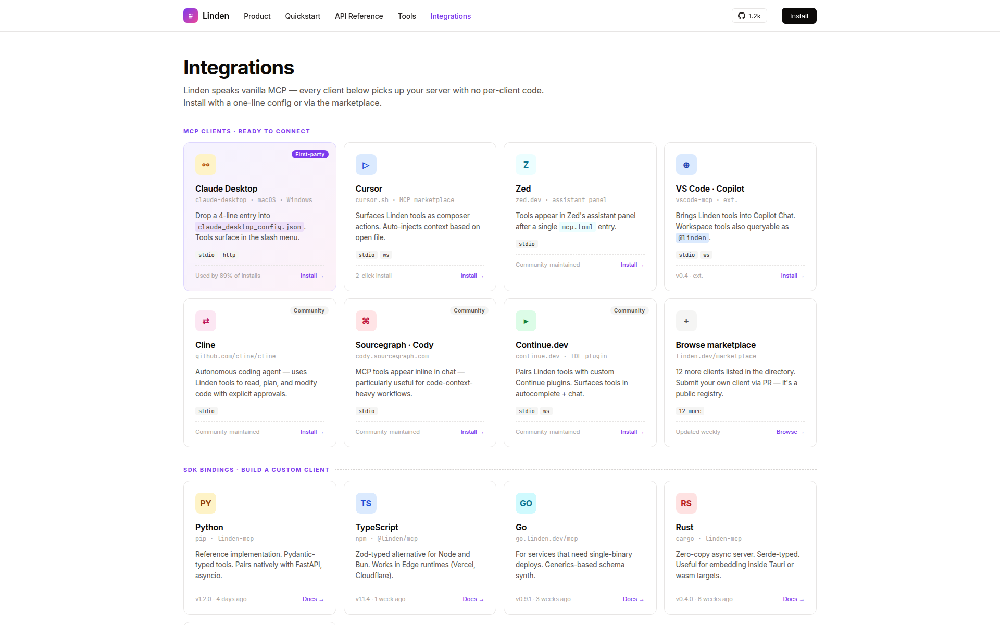

<div align="center">

# Linden — MCP Server for Database + API Tools

**Typed MCP servers in one line of Python — sandboxed, observable, streaming. Drop-in for Claude Desktop, Cursor, Zed.**



[](https://www.python.org/)
[](https://github.com/modelcontextprotocol/python-sdk)
[](https://fastapi.tiangolo.com/)
[](https://github.com/pgvector/pgvector)
[](LICENSE)

</div>

## What it does

Linden is a production-grade [Model Context Protocol](https://modelcontextprotocol.io) server built on the official `mcp` Python SDK. It exposes **typed tools across SQL, semantic search, and HTTP** — a sandboxed Postgres query path, document search over pgvector, and a sample HTTP API integration — all with auto-generated JSON-Schemas from Pydantic types.

The same server speaks stdio, HTTP, and SSE transports without code changes. Configuration examples for Claude Desktop, Cursor, and Zed ship in the repo.

## Features

- **Pydantic-typed tools** — `@srv.tool` decorator infers a canonical JSON-Schema from your type hints. No hand-written tool definitions, no drift.
- **SQL safely** — every query parsed and validated with `sqlglot` AST inspection: blocks DDL, enforces read-only role, injects `LIMIT`, hard timeouts.
- **Two transports, one server** — stdio for local desktop clients, HTTP + SSE for remote / cloud agents; same async tool functions either way, no per-client code.
- **Defense-in-depth SQL sandbox** — regex keyword ban → sqlglot AST validation (SELECT-only, no DDL, no CTE-wrapped writes) → LIMIT injection → read-only Postgres role with a 5 s statement timeout. Each layer is independent.
- **Production hardening** — structured JSON logs with per-request correlation IDs, constant-time API-key comparison, token-bucket rate limiting on the HTTP transport.

## Screenshots

<table>
<tr>
<td width="50%"></td>
<td width="50%"></td>
</tr>
<tr>
<td></td>
<td></td>
</tr>
<tr>
<td></td>
<td></td>
</tr>
</table>

## Tools shipped

| Family | Tool | Description |
|--------|------|-------------|
| Database | `sql_query` · `list_tables` | Sandboxed Postgres SELECT: regex ban + sqlglot AST validation + LIMIT injection + read-only role with 5 s statement timeout. |
| Search | `search_documents` | OpenAI-embedded query against a pgvector HNSW index over documents (cosine, top-k). |
| HTTP / API | `weather_current` · `weather_forecast` | Typed HTTP integration against Open-Meteo with tenacity retries — a reference example for adding more API tools. |

## Stack

| Layer       | Tech |
|-------------|------|
| Protocol    | `mcp` Python SDK ≥ 1.1 (tools + resources) |
| Transport   | FastAPI (HTTP, SSE), official SDK (stdio) |
| Validation  | Pydantic 2 → JSON-Schema, sqlglot AST for SQL |
| Storage     | Postgres 16, pgvector, SQLAlchemy 2 + asyncpg, Alembic |
| Observability | structlog JSON logs with per-request correlation IDs, response timing headers |
| Ops         | Docker Compose, Tenacity retries, token-bucket rate limit |

## Run locally

```bash
git clone https://github.com/vltech55/linden-mcp
cd linden-mcp
cp .env.example .env       # add OPENAI_API_KEY for semantic search
docker compose up -d --build
docker compose exec server alembic upgrade head
docker compose exec server python -m scripts.seed_demo
```

To use with **Claude Desktop**, add to your `claude_desktop_config.json`:

```json
{
  "mcpServers": {
    "linden": {
      "command": "docker",
      "args": ["compose", "-f", "/path/to/linden-mcp/docker-compose.yml", "exec", "-T", "server", "python", "-m", "linden.stdio"]
    }
  }
}
```

See [`claude_desktop_config.example.json`](claude_desktop_config.example.json) for the full example.

## Architecture

```
       any MCP client
   (Claude Desktop, Cursor, Zed, …)
              │
              │  MCP protocol  (stdio / HTTP / SSE)
              │
       ┌──────▼───────┐
       │  Linden      │
       │  ─────────   │
       │  ┌────────┐  │     ┌──────────────────┐
       │  │ sql_*  │──┼────▶│ 4-layer sandbox  │──▶ Postgres (mcp_readonly,
       │  │ tools  │  │     │ regex → AST →    │   default_txn_read_only=on,
       │  └────────┘  │     │ LIMIT → role     │   statement_timeout=5s)
       │              │     └──────────────────┘
       │  ┌────────┐  │     ┌──────────────────┐
       │  │search_ │──┼────▶│ OpenAI embed +   │──▶ pgvector cosine
       │  │docs    │  │     │ <=> distance     │   HNSW index
       │  └────────┘  │     └──────────────────┘
       │              │
       │  ┌────────┐  │     ┌──────────────────┐
       │  │weather_│──┼────▶│ httpx + tenacity │──▶ Open-Meteo
       │  │* tools │  │     │ retries (3×, 1-8s)│
       │  └────────┘  │     └──────────────────┘
       └──────┬───────┘
              │
              ▼
       structlog JSON (request_id correlation)
```

## Tests

```bash
docker compose exec server pytest
```

Covers sqlglot AST sanitisation (rejects DDL/DML, blocks CTE-wrapped writes), LIMIT clamping, transport equivalence (stdio == HTTP == SSE), and schema inference from Pydantic types.

## License

MIT
